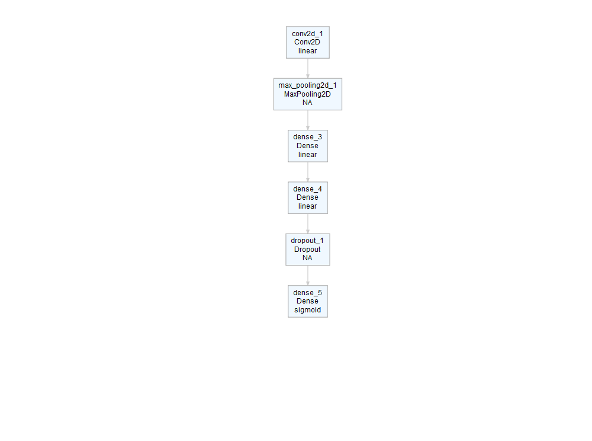
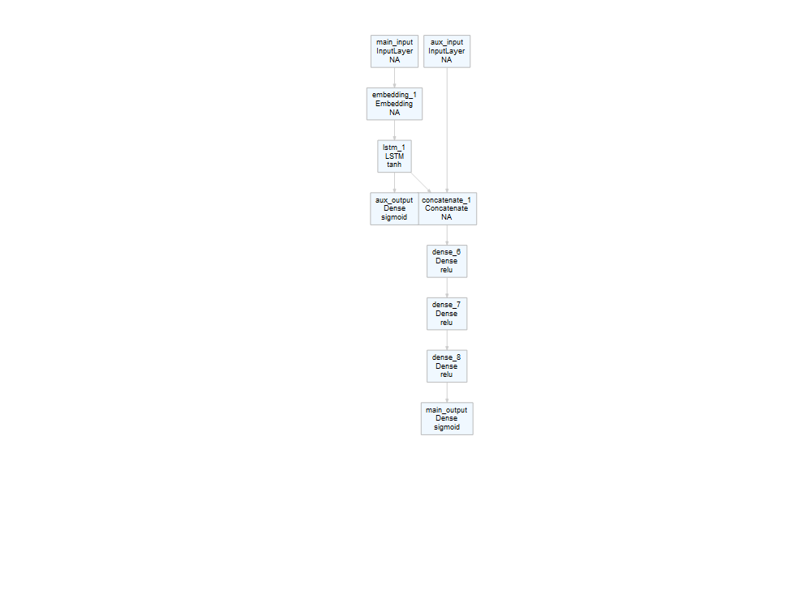
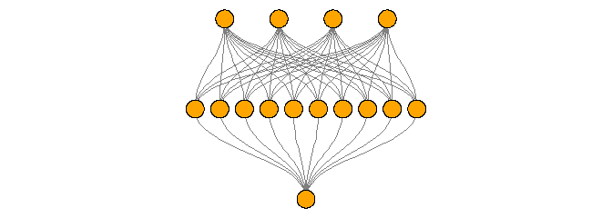
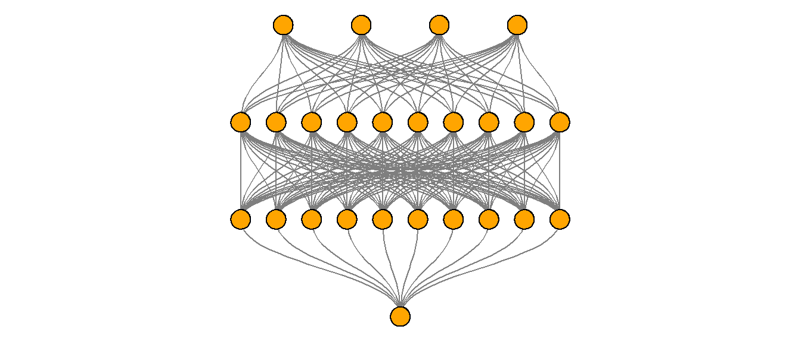
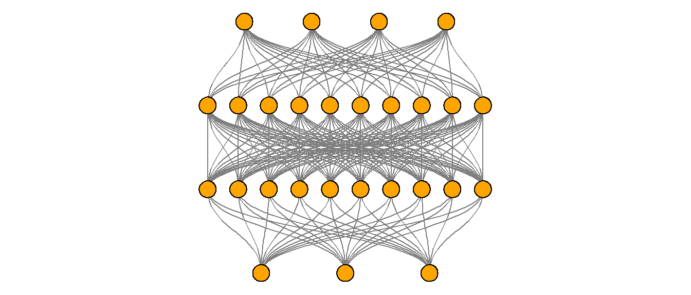

Untitled
================

# deepviz

The goal of deepviz is to visualize (simple) neural network
architectures.

## Installation

``` r
devtools::install_github("andrie/deepviz")
```

## Load the packages

``` r
library(deepviz)
library(magrittr)
```

## plot\_model() with sequential models

Create a model

``` r
require(keras)
#> Loading required package: keras
```

``` r
model <- keras_model_sequential() %>%
  layer_dense(10, input_shape = 4) %>%
  layer_dense(2, activation = "sigmoid")
```

Plot the model

``` r
model %>% plot_model()
```


Add some more layers and plot

``` r
model <- keras_model_sequential() %>%
  layer_conv_2d(filters = 16, kernel_size = c(3, 3)) %>% 
  layer_max_pooling_2d() %>% 
  layer_dense(10, input_shape = 4) %>%
  layer_dense(10, input_shape = 4) %>%
  layer_dropout(0.25) %>% 
  layer_dense(2, activation = "sigmoid")

model %>% plot_model()
```


``` r
model %>% plot_model()
```



## plot\_model() with network models

Construct a network model using the `keras` function API, using the
example from <https://keras.rstudio.com/articles/functional_api.html>

``` r
model <- local({
  main_input <- layer_input(shape = c(100), dtype = 'int32', name = 'main_input')

  lstm_out <- main_input %>%
    layer_embedding(input_dim = 10000, output_dim = 512, input_length = 100) %>%
    layer_lstm(units = 32)

  auxiliary_output <- lstm_out %>%
    layer_dense(units = 1, activation = 'sigmoid', name = 'aux_output')

  auxiliary_input <- layer_input(shape = c(5), name = 'aux_input')

  main_output <- layer_concatenate(c(lstm_out, auxiliary_input)) %>%
    layer_dense(units = 64, activation = 'relu') %>%
    layer_dense(units = 64, activation = 'relu') %>%
    layer_dense(units = 64, activation = 'relu') %>%
    layer_dense(units = 1, activation = 'sigmoid', name = 'main_output')

  keras_model(
    inputs = c(main_input, auxiliary_input),
    outputs = c(main_output, auxiliary_output)
  )
})

model
#> Model
#> ___________________________________________________________________________
#> Layer (type)            Output Shape     Param #  Connected to             
#> ===========================================================================
#> main_input (InputLayer) (None, 100)      0                                 
#> ___________________________________________________________________________
#> embedding_1 (Embedding) (None, 100, 512) 5120000  main_input[0][0]         
#> ___________________________________________________________________________
#> lstm_1 (LSTM)           (None, 32)       69760    embedding_1[0][0]        
#> ___________________________________________________________________________
#> aux_input (InputLayer)  (None, 5)        0                                 
#> ___________________________________________________________________________
#> concatenate_1 (Concaten (None, 37)       0        lstm_1[0][0]             
#>                                                   aux_input[0][0]          
#> ___________________________________________________________________________
#> dense_6 (Dense)         (None, 64)       2432     concatenate_1[0][0]      
#> ___________________________________________________________________________
#> dense_7 (Dense)         (None, 64)       4160     dense_6[0][0]            
#> ___________________________________________________________________________
#> dense_8 (Dense)         (None, 64)       4160     dense_7[0][0]            
#> ___________________________________________________________________________
#> main_output (Dense)     (None, 1)        65       dense_8[0][0]            
#> ___________________________________________________________________________
#> aux_output (Dense)      (None, 1)        33       lstm_1[0][0]             
#> ===========================================================================
#> Total params: 5,200,610
#> Trainable params: 5,200,610
#> Non-trainable params: 0
#> ___________________________________________________________________________
```

Plot the model

``` r
model %>% plot_model()
```



## plot\_deepviz()

### Logistic regression:

``` r
c(4, 1) %>% 
  plot_deepviz()
```


### One hidden layer:

``` r
c(4, 10, 1) %>% 
  plot_deepviz()
```



### A multi-layer perceptron (two hidden layers):

``` r
c(4, 10, 10, 1) %>% 
  plot_deepviz()
```



### Multi-class classification

``` r
c(4, 10, 10, 3) %>% 
  plot_deepviz()
```


