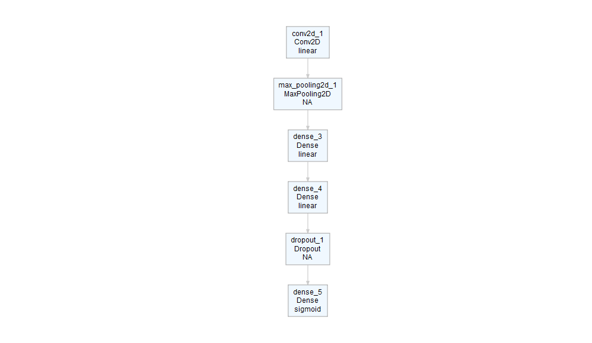

<!-- README.md is generated from README.Rmd. Please edit that file -->

# deepviz

The goal of deepviz is to visualize (simple) neural network
architectures.

## Installation

``` r
devtools::install_github("andrie/deepviz")
```

## Load the packages

``` r
library(deepviz)
library(magrittr)
```

## plot\_model()

Create a model

``` r
require(keras)
#> Loading required package: keras

model <- keras_model_sequential() %>%
  layer_dense(10, input_shape = 4) %>%
  layer_dense(2, activation = "sigmoid")
```

Plot the model

``` r
model %>% plot_model()
```


Add some more layers and plot

``` r
model <- keras_model_sequential() %>%
  layer_conv_2d(filters = 16, kernel_size = c(3, 3)) %>% 
  layer_max_pooling_2d() %>% 
  layer_dense(10, input_shape = 4) %>%
  layer_dense(10, input_shape = 4) %>%
  layer_dropout(0.25) %>% 
  layer_dense(2, activation = "sigmoid")

model %>% plot_model()
```



``` r
model %>% plot_model()
```


## plot\_deepviz()

### Logistic regression:

``` r
c(4, 1) %>% 
  plot_deepviz()
```


### One hidden layer:

``` r
c(4, 10, 1) %>% 
  plot_deepviz()
```


### A multi-layer perceptron (two hidden layers):

``` r
c(4, 10, 10, 1) %>% 
  plot_deepviz()
```


### Multi-class classification

``` r
c(4, 10, 10, 3) %>% 
  plot_deepviz()
```


